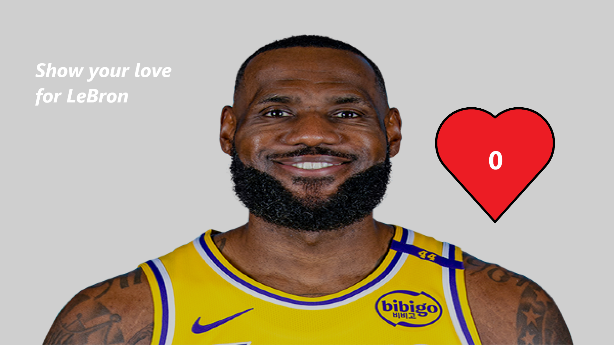

# Eye of Rah

## About

Eye of Rah is a CTF challenge designed to test problem-solving and web security skills.  
The challenge consists of multiple stages where participants must analyze and interact with a web application to retrieve the flag.

## Team Members

- Svante Ericsson ([svasim1](https://github.com/svasim1))
- Dennis Forslund ([ABB22denfor](https://github.com/ABB22denfor))

## Description

The challenge begins with a webpage featuring the "Eye of Rah" symbol, a text prompt, and an input field.  
Successful progression leads to another page with a unique design and interactive elements.  
Participants must carefully inspect the application to find the hidden flag.

    
    

## Difficulty

**Estimated difficulty: 0.7 (on a scale of 0-1)**

The challenge is designed to be accessible yet engaging, requiring logical thinking and some knowledge of web technologies.  
While initially estimated at **0.3**, further testing showed that around **60-70%** of participants could solve it, leading to a revised difficulty of **0.7**.

## Flag Format

The flag follows the format:
**CTF220s{...}**

---

Good luck, and enjoy the challenge!
