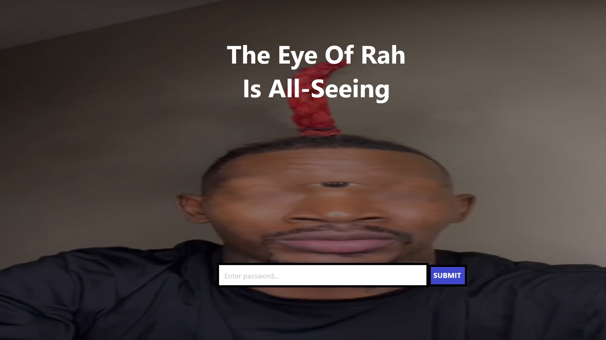

# Eye of Rah - Documentation

## Group Members

- Svante Ericsson ([svasim1](https://github.com/svasim1))
- Dennis Forslund ([ABB22denfor](https://github.com/ABB22denfor))

## Challenge Name

**Eye of Rah**

## Description

Our website contains a background image of the "Eye of Rah" with accompanying text and an input field.  
After guessing the correct password, the user is sent to another page with a LeBron James background, a heart, and a click counter.  
The key will be displayed on the page after correct user input.

    
    

## Solution

    
SPOILERS

    
The user should use SQL injection to solve the first page and get the password with a command similar to:

    <pre><code>SELECT password FROM brainrot WHERE meme = 'eye-of-rah'</code></pre>
    
The second page is solved by reaching LeBron's career points tally using web devtools to manipulate the click counter.

## Difficulty

**0.7**

    
SPOILERS

    
The initial difficulty was estimated at 0.3, but after developing it, we realized that more than 30% of the class could solve the challenge using devtools.  
    We now estimate that around 60-70% of the class will be able to solve the challenge, increasing the difficulty rating to 0.7.

## Flag

    
SPOILERS

    
CTF220s{...}

## Reflection

Our initial difficulty assessment was too low, as we assumed that SQL injection would be a greater challenge than it turned out to be.  
After testing, we realized that more people could solve the challenge, especially by using devtools on the second page.  
Therefore, we have adjusted the difficulty level from 0.3 to 0.7.  
Apart from this, the challenge has followed our original plan relatively well.
