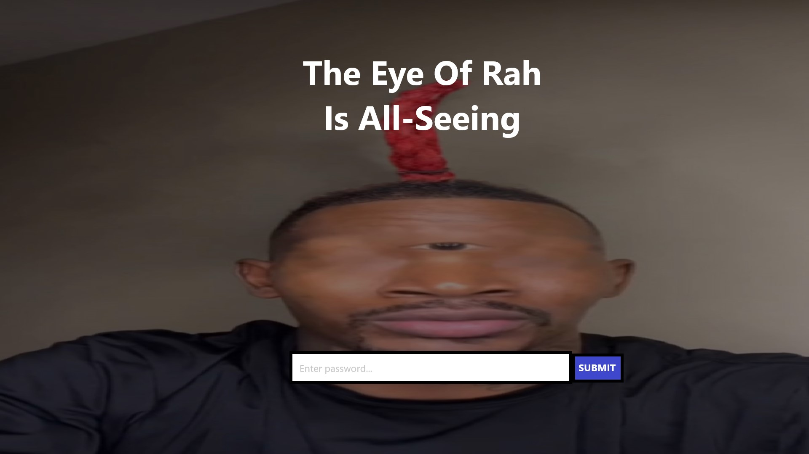
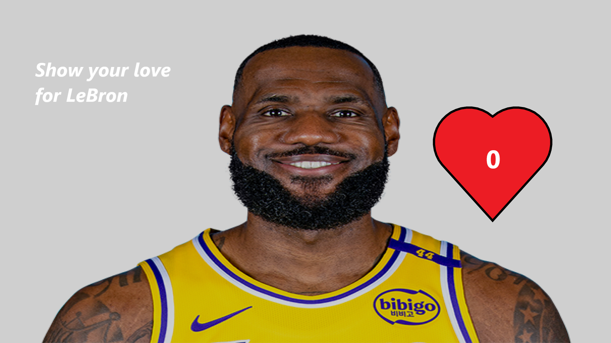

# Eye of Rah Plan

## Group Members
Svante Ericsson [svasim1](https://github.com/svasim1) 
Dennis Forslund [ABB22denfor](https://github.com/ABB22denfor)

## Description
Our website contains a background image of the "Eye of Rah" with accompanying text and an input field. 
After guessing the correct password the user is sent to another page with a LeBron James background with a heart and a click counter. 
The key will be displayed on the page after correct user input.

## Solution

    
SPOILERS

    The user should use SQL injection to solve the first page and get the password, with a command similar to SELECT password FROM brainrot WHERE meme = eye-of-rah
    
    The second page is solved by reaching the same number of clicks as LeBrons career points tally, using web devtools as help

## Difficulty
Our estimated difficulty for Eye of Rah is a 0.3, on a scale from 0-1 where the decimal represents the percentage of people able to solve the problem.
